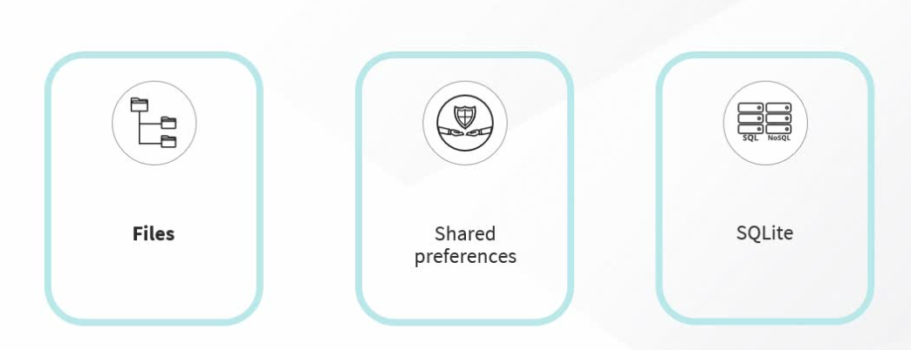

# Persisting Data on the Local Device
When building mobile applications, there is often the need to store data locally on the mobile device, either across the application’s sessions or to store user preferences. Based on the size and complexity of the data, there are several choices to store data locally.
## Local Persistence in Flutter

Let's say you need to store data locally in Flutter, that is, you need to persist data on your mobile device. What are the options you have? There are a number of different options. We'll discuss just the three most common. The first is you can store data on the file system of your mobile device. This of course involves reading from and writing to files. Or you can store data locally using SharedPreferences. This allows you to store data in the form of key-value pairs typically used for user's preference data. Yet another option is you store data in an embedded database such as SQLite. This allows you to query your data using SQL queries, manipulate your data and everything that you'd expect from a database. When would you choose to use the file system to store data?

The file system is a great option if you have unstructured data, maybe data in the form of long form text and you want to preserve this data across app launches. The file system is also a great option if you want to download and store data that you've accessed from the Internet and you want to be able to access this data offline later on sometime. Another reason to potentially use files to store data is that you want to be able to share the file with other users using some kind of sharing services, maybe e-mail or some kind of messenger service. With Flutter, storing files on your local device is very straightforward. Flutter apps can use libraries to access, read, and write data stored on your device's disk. Your mobile device has a file system, and there are certain locations in that file system that your app can write to.

You'll use the **path_provider** plugin to find correct local path on disk where you want to write your files. And then you'll use the **dart:io** library to read data from and write data to the file. The path_provider package is an extremely useful dart library that provides a platform-agnostic way to access locations on the device's file system. With the path_provider, you use the same set of APIs whether you're running your Flutter app on Android, iOS, or some other mobile device. Now, there are different local paths that are accessible by Flutter. There is a temporary directory on your device that is a cache that is available to the system as a whole. The system can clear this at any point-in-time. This temporary directory is not entirely in your app's control, so you may want to think twice before you store your files there. Instead, you may want to use the **documents directory**.

The documents directory allows the app to store files where only the app can access those files. So your mobile operating system cannot delete files in this documents directory, unless you delete your app. The system clears this data only when the app is deleted. The app controls this data until then. We've discussed persisting data in files on a local device. Next, let's discuss SharedPreferences to persist data locally. First, we'll discuss when you would choose to use SharedPreferences to store data. If you have collections of data where your data is rather lightweight and can be represented using key-value pairs, SharedPreferences is the right choice. As the name implies, this is often used to store user preferences such as font size or theme. This is very useful for small amounts of data, data that is local to the app, data that need not be shared with other people or applications. When you use SharedPreferences to store data, you use the **SharedPreferences plugin**. This plugin wraps the **NSUserDefaults** on iOS and the **SharedPreferences** on Android. The data that you store using SharedPreferences can't be very complex. It supports only primitive types such as int, double, boolean, string, and a list of strings. Data is stored in the form of key-value pairs. Keys are always strings and values can be these other primitive types. Key-value pairs are updated synchronously in memory first and then asynchronously written out to disk. Reading a value using a particular key is always synchronous. 

Now let's move on to discussing the third technique that you can use to persist data using SQLite.  SQLite is a database engine written in the C programming language. SQLite is actually an embedded database. Software developers use the SQLite library, and that database is embedded into the application. If you want to persist large amounts of data on your local device, you need a way to store and query this data efficiently. You need an interface that supports SQL queries, allowing you to access and manipulate data. That's when SQLite is really useful. This also means that the data that you store in SQLite can be more complex. You can have entities with multiple attributes. You also get faster performance from your queries for inserts, deletes, and updates when you use SQLite. When you use SQLite from within Flutter, you'll need to use the **SQFlite** package. This is what gives you the classes and functions that you need to interact with the SQLite database. In addition, you'll need to use the **path package**, which gives you functions to define the location for where you want the database to be stored on disk.

